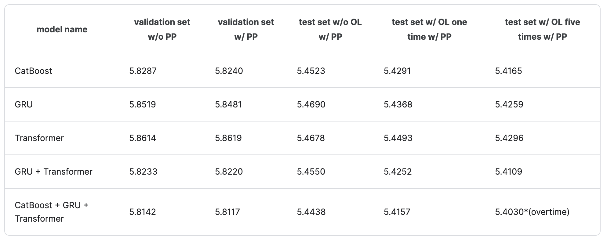
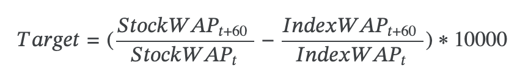
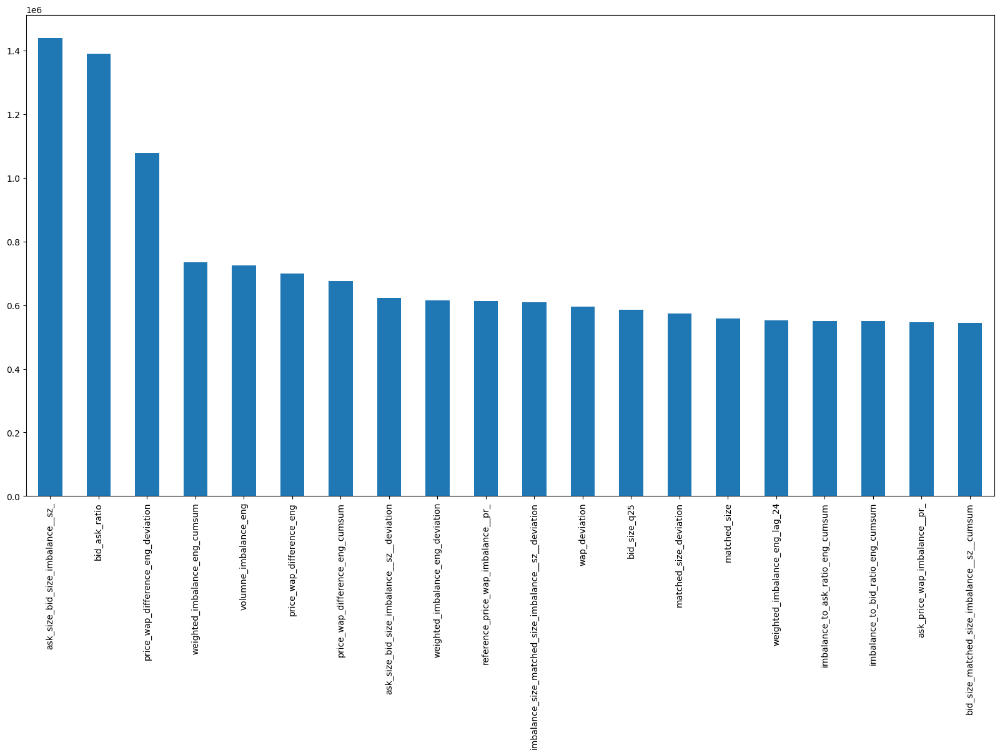

<!-- _class: title -->
# Optiver trading at the close 上位解法まとめ

 @richwomanbtc

---

## 概要
- 上位解法まとめ
  - 特に7th solutionモデルに着目
- Kaggle初心者目線
  - Kaggle特有のテクニック等は詳しくない
  - コンペには参加(1836位/3176位)
- 実験
  - 主にモデルの比較
---

## 1st solution
https://www.kaggle.com/competitions/optiver-trading-at-the-close/discussion/487446
- Catboost(0.5), 4 layer GRU(0.3), 4 layer Transformer(0.2)
- 400日をtrain, 81日をvalid
- `seconds_in_bucket_group`(300秒まで、300~480秒まで、480秒以上の3つのgroup)でgroup化
- `seconds_in_bucket`でgroup化してrank
- 300 features by CatBoost model's feature importance
- オンライン学習ではメモリ制約をうまく回避して特徴量を減らさないようにした
- 出力のsumが0になるようにしている
- 出力がindexからの乖離になるようにpost processing

---

## 1st solution
 
https://www.kaggle.com/competitions/optiver-trading-at-the-close/discussion/487446

---

## 6th solution
https://www.kaggle.com/competitions/optiver-trading-at-the-close/discussion/486040

- NN only
- 時間フラグ(1stの`seconds_in_bucket_group`)とほぼ同等
  - 1stと違ってgroup化してるわけではなさそう
- 359日をtrain, 121日をvalid
- 特徴量は35~36個
  - windowは2日分
  - 出力は(batch_size, number_stocks, 55)
- 出力のsumが0になるようにしている
- 4 layer transformer(3個) and GRU(1個)

---

## 7th solution
https://www.kaggle.com/competitions/optiver-trading-at-the-close/discussion/486169

- CNN + LSTM + LightGBM
- 中央値からの乖離特徴量
- codeは[こちら](https://github.com/nimashahbazi/optiver-trading-close)
- post processingはなし

---

## 9th solution
https://www.kaggle.com/competitions/optiver-trading-at-the-close/discussion/486868

- XGBoost only
  - LightGBMと大差なかった
- group化した特徴量を使っていたようだが詳細はよくわからなかった
- 特徴量は157個(メモリ制約から絞る必要があった)
- 最新の45日間のデータに1.5の重みを設定
- 出力がindexからの乖離になるようにpost processing
- codeは[こちら](https://github.com/ChunhanLi/9th-kaggle-optiver-trading-close)

--- 
<!--
## 14th solution
https://www.kaggle.com/competitions/optiver-trading-at-the-close/discussion/485985

- [code](https://www.kaggle.com/code/cody11null/14th-place-gold-cat-lgb-refit)

---

## 25th solution
https://www.kaggle.com/competitions/optiver-trading-at-the-close/discussion/485967
- [code](https://github.com/nlztrk/Optiver-Trading-at-the-Close)

--- -->

## 実験
codeは[こちら](https://github.com/richwomanbtc/makedeco-optiver)
- 7th solutionをベースに特徴量を固定して複数モデル(後述)を比較
- CVは400日train, 81日valid
  - validの結果とLBはある程度相関があるとして、validで比較
- Post processingを行う(ref: 1st solution)
- Online learningは考慮しない
- polarsで再実装

---

## モデル
| Model       | Description                                   |
| ----------- | --------------------------------------------- |
| LightGBM    | 7th solutionのハイパーパラメータ              |
| CatBoost    | LightGBMのハイパーパラメータと極力合わせた    |
| XGBoost     | LightGBMのハイパーパラメータと極力合わせた    |
| CNN         | 7th solutionのモデル                          |
| LSTM        | 7th solutionのモデル                          |
| GRU         | LSTM部分をGRUに変更したモデル                 |
| Transformer | LSTM部分を4 layer Transformerに変更したモデル |

---
## 特徴量 (7th solution, for tree models)

- 生特徴量
- ベース特徴量(spread等、後述)
- imbalance特徴量(各種size, 各種price)
- lag特徴量(生特徴量, ベース特徴量)
- 累積特徴量(各種size, imbalance特徴量, ベース特徴量)
- `["date_id", "seconds_in_bucket"]`でgroup化して中央値からの乖離を取った特徴量(生特徴量, ベース特徴量, imbalance size特徴量)
- Global features
  - stock_idでgroup化した特徴量

---

## ベース特徴量(1)

| name                  | description                   |
| --------------------- | ----------------------------- |
| spread                | ask_price - bid_price         |
| volume                | ask_size + bid_size           |
| volumne_imbalance     | bid_size - ask_size           |
| imbalance_ratio       | imbalance_size - matched_size |
| price_spread_near_far | near_price - far_price        |
| price_wap_difference  | reference_price - wap         |


---

## ベース特徴量(2)
| name                             | description                              |
| -------------------------------- | ---------------------------------------- |
| weighted_imbalance               | imbalance_size * imbalance_buy_sell_flag |
| bid_ask_ratio                    | bid_size / ask_size                      |
| imbalance_to_bid_ratio           | imbalance_size / bid_size                |
| imbalance_to_ask_ratio           | imbalance_size / ask_size                |
| matched_size_to_total_size_ratio | matched_size / (bid_size + ask_size)     |

---

## Global features

- stock_idごとに集計した特徴量
```python
def global_features(df: pl.DataFrame) -> pl.DataFrame:
    columns = ["bid_size", "ask_size", "bid_price", "ask_price"]
    groupby_cols = ["stock_id"]
    global_features_df = (
        df.group_by(groupby_cols).agg(to_describe(columns)).sort("stock_id")
    )
    global_features_df = global_features_df.with_columns(
        median_size=pl.col("bid_size_median").add(pl.col("ask_size_median")),
        std_size=pl.col("bid_size_std").add(pl.col("ask_size_std")),
        ptp_size=pl.col("bid_size_max").sub(pl.col("ask_size_min")),
        median_price=pl.col("bid_price_median").add(pl.col("ask_price_median")),
        std_price=pl.col("bid_price_std").add(pl.col("ask_price_std")),
        ptp_price=pl.col("bid_price_max").sub(pl.col("ask_price_min")),
    )
    return df.join(global_features_df, on="stock_id", how="left")
  ```


---


## NN特徴量
- 生特徴量 + target lag(1~3) + imbalance price/size + 中央値からの乖離を取った特徴量 + Global features$^1$
- ["date_id", "stock_id"]でgroup化してwindow=3でバッチ化

>>> 1: 実験では分位点(25%点や75%点)等も入れてしまったが、7th solutionのコードでは入っていない

---

## NN Architecture (CNN)
差分layer: lagを取ってpadding
```
numerical_input (window_size=3, features=2)
[
  [1, 2],
  [2, 3],
  [3, 4]
]
↓
lag=1
[
  [1, 1],  # (2-1, 3-2)
  [1, 1],  # (3-2, 4-3)
]
↓
padding
[
  [0, 0],  # padding
  [1, 1],
  [1, 1]
]
```

---
<!-- _class: split -->
## NN Architecture (LSTM/GRU)


- numerical featuresとcategorical featuresを分けてembedding
- このあとにLSTM/GRU -> dense layerが続く

---

## NN Architecture (Transformer)

https://keras.io/examples/timeseries/timeseries_classification_transformer/
これを拝借
```python
def transformer_encoder(inputs, head_size, num_heads, ff_dim, dropout=0):
    # Attention and Normalization
    x = layers.MultiHeadAttention(
        key_dim=head_size, num_heads=num_heads, dropout=dropout
    )(inputs, inputs)
    x = layers.Dropout(dropout)(x)
    x = layers.LayerNormalization(epsilon=1e-6)(x)
    res = x + inputs

    # Feed Forward Part
    x = layers.Conv1D(filters=ff_dim, kernel_size=1, activation="relu")(res)
    x = layers.Dropout(dropout)(x)
    x = layers.Conv1D(filters=inputs.shape[-1], kernel_size=1)(x)
    x = layers.LayerNormalization(epsilon=1e-6)(x)
    return x + res
```

---


## Post processing (1st solution)
```python
prediction_df["stock_weights"] = prediction_df["stock_id"].map(weight)
prediction_df["target"] = (
    prediction_df["target"]
    - (prediction_df["target"] * prediction_df["stock_weights"]).sum()
    / prediction_df["stock_weights"].sum()
)
```


この形を意識

---
<!-- _class: split -->
## 実験結果

  | Model       | Score   | Score(w/PP) |
  | ----------- | ------- | ----------- |
  | LightGBM    | 5.83807 | 5.83807     |
  | CatBoost    | 5.85796 | 5.85791     |
  | XGBoost     | 5.84004 | 5.84004     |
  | CNN         | 5.86448 | -           |
  | GRU         | 5.86424 | -           |
  | LSTM        | 5.86781 | -           |
  | Transformer | 5.87409 | -           |

- LightGBMが最も良い結果
- NNの結果に対するPPの実装が間に合わなかった(後日追記します)
- Transformerは多分実装がよろしくない

---

### 7th solutionとの比較

https://github.com/nimashahbazi/optiver-trading-close/blob/master/training/optiver-258-lgb-submit.ipynb

```python
# public-validation
# dates_train = [0,390]
# dates_test = [391,480]
~~~
~~~
lgb_preds Score on Test: 5.860964545705968
nn_preds Score on Test: 5.871083373009854
rnn_preds Score on Test: 5.8716475533769525
```

- train/test期間を合わせたほうがわかりやすかった(実験終わってから気づいた)
- inferenceのコードを見てるとrandom seed avaragingしているのでもう少し良くなるはず
- 大体再現できていそう
---

## 考察

- モデル比較
- 特徴量
- CV
- アンサンブル


---
<!-- _class: split -->
## 考察: モデル比較

  | Model       | Score   | Score(w/PP) |
  | ----------- | ------- | ----------- |
  | LightGBM    | 5.83807 | 5.83807     |
  | CatBoost    | 5.85796 | 5.85791     |
  | XGBoost     | 5.84004 | 5.84004     |
  | CNN         | 5.86448 | -           |
  | GRU         | 5.86424 | -           |
  | LSTM        | 5.86781 | -           |
  | Transformer | 5.87409 | -           |

- Treeの方が良い結果
  - 1st, 7th solutionとcompatible
- 1st solutionのように`seconds_in_bucket_group`でgroup化した特徴量を入れてみるのもいいかも

---

## 考察: Feature importance (lightgbm, top 20)


---

## 考察: 特徴量
- 特徴量の加工はシンプルなものが多かった
- 問題の構造を反映した特徴量&group化
  - cross sectional
   
  - time group

---

## 考察: CV

- 単純な時間による2分割CVで十分そう
  - optiverの以前のコンペでもTimeSeriesSplitが使われていた
- (個人的には)時間で5分割kfoldしてvalidation setの平均を出していたが、LBとの相関はあまりなさそうに感じた
- LBとの相関が高いCVのやり方をまず見つけるのが重要

---

## 考察: アンサンブル
| Model                             | Score + PP |
| --------------------------------- | ---------- |
| LGB * 0.6 + XGB * 0.3 + CAT * 0.1 | 5.83871    |
- weightは適当
- 少し良くなる
- 実装上の都合でNNを含めたアンサンブルの結果は間に合わず
  - 後日追記予定


---

## まとめ
- Tree modelと時系列NNが使われていた
  - Tree modelがNNよりちょっと良い結果
    - ただし、6th solutionはNN only
  - アンサンブルで少し良くなるはず
- group化した特徴量が効いている
- post processingによるスコアの改善
- ある程度再現の取れた実験が行えた